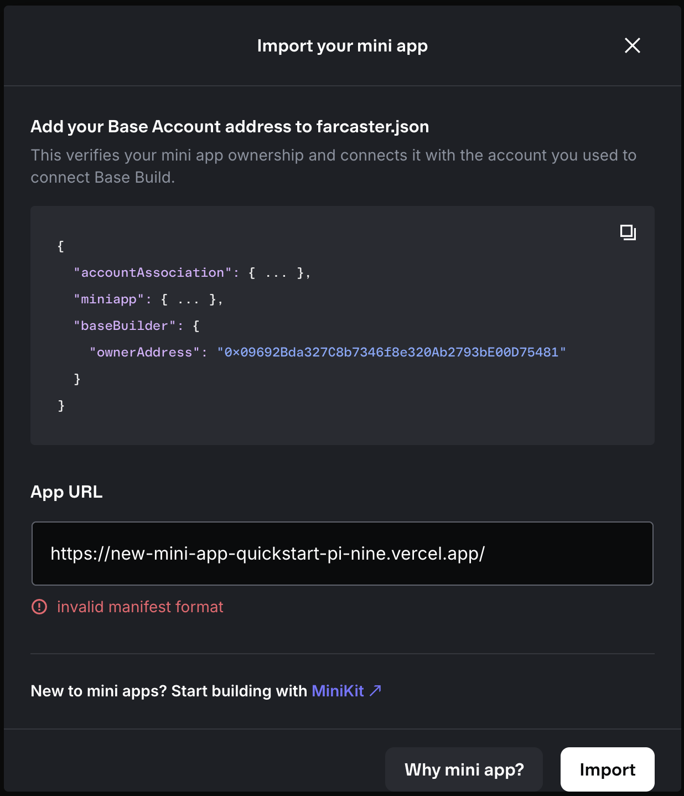
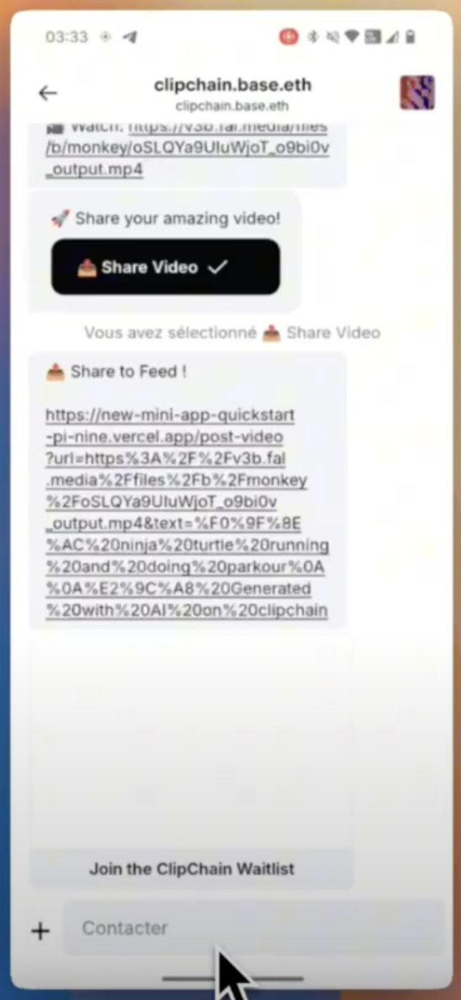

# ClipChain - Issues & Feedback

This document tracks issues encountered during development and testing of ClipChain for ETHRome 2025.

## Base App Issues

### 1. Connection Issues

**Issue**: Wasn't able to connect to the Base App consistently.

**Status**: Under investigation

---

### 2. Invalid Manifest Format Error

**Issue**: Encountered "invalid manifest format" error when trying to import the mini app.

**Screenshot**:

**Details**:

- Error appears when adding the Base Account address to `farcaster.json`
- App URL: `https://new-mini-app-quickstart-pi-nine.vercel.app/`
- The manifest validation fails during the import process

**Status**: Needs investigation - possibly related to `farcaster.json` configuration

---

### 3. Developer Settings Missing

**Issue**: One team member didn't have the developer field in settings.

**Details**:

- Location: Belgium
- This appears to be a regional availability issue
- Prevents team member from accessing developer features

**Status**: Potential regional restriction

---

### 4. Unable to Like/React from Mini App

**Issue**: Cannot like or react to posts from within the mini app interface.

**Status**: To be confirmed - requires further testing

**Impact**: Limits user engagement capabilities within the mini app

---

### 5. Repost Functionality Issues

**Issue**: Had trouble with the repost feature.

**Details**:

- Only one team member has the Base App installed
- Self-reposting might not be working as intended
- Unable to verify if this is a genuine issue or limitation due to single-user testing

**Status**: Might not be an issue - needs multi-user testing to confirm

---

## XMTP Issues

### 1. Video Sharing UX - Multi-Step Process

**Issue**: Publishing videos requires a two-step process:

1. Click button to generate share link
2. Click on the generated URL to open in browser

**Screenshot**:

**Potential Improvement**:
- Telegram deep links (`https://t.me/`) could potentially streamline this process
- We know a workaround exists in Telegram for this issue, but haven't tested if it works in the Base App/XMTP context

**Status**: Workaround known but not yet tested - potential improvement for future iteration

**Technical Notes**:
- Current flow shows: Video URL → "Share Video" button → Feed URL with encoded video
- Deep links could potentially reduce friction in the sharing experience
